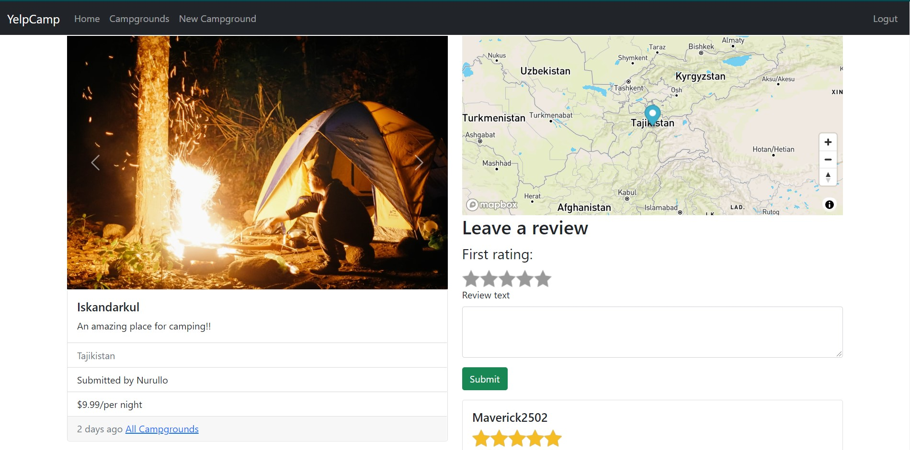

# YelpCamp
> YelpCamp is one of the projects done as part of the  course - [The Web Developer Bootcamp by Colt Steele](https://www.udemy.com/the-web-developer-bootcamp/)
### It is a web application designed to add, rate and review different campgrounds, different users (read campers) can put in their comments and concerns, so that it is a well informed and well prepared camping trip for other users.

 The code needs the following environment variables:
 - CLOUDINARY_CLOUD_NAME
 - CLOUDINARY_KEY
 - CLOUDINARY_SECRET
 - MAPBOX_TOKEN* (included in the code)
 
 All of these are obtainable from your Cloudinary account.
 
 ## Initialization
 Run `npm install` to install required packages.

 Then, run `nodemon` or `node app.js` to start the server.

 In case, you need to update your seeds run `node seeds/index.js`

 Access through http://localhost:3000/

 The app has been deployed with Heroku, and can be accessed through https://yelp-camp-2502.herokuapp.com/

## Built with

### Front-end

* HTML/CSS/JS
* [ejs](http://ejs.co/)
* [Bootstrap 5](https://getbootstrap.com/docs/5.0/getting-started/introduction/)

### Back-end

* [express](https://expressjs.com/)
* [mongoDB](https://www.mongodb.com/)
* [mongoose](http://mongoosejs.com/)
* [async](http://caolan.github.io/async/)
* [passport](http://www.passportjs.org/)
* [passport-local](https://github.com/jaredhanson/passport-local#passport-local)
* [express-session](https://github.com/expressjs/session#express-session)
* [method-override](https://github.com/expressjs/method-override#method-override)
* [connect-flash](https://github.com/jaredhanson/connect-flash#connect-flash)

 

### Feel free to clone and play around

```sh
git clone https://github.com/Maverick2502/YelpCamp.git
          
```
 # Screenshots


